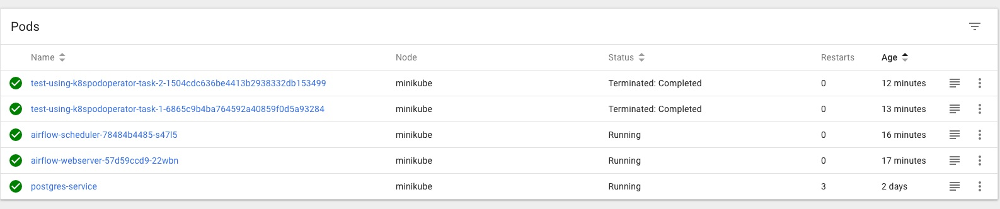

# Airflow K8S Pod Operator
The KubernetesPodOperator is by far the easiest way to get started running containerized workloads from Airflow on Kubernetes. Setup and management are minimal and since you can customize parameters and arguments per workload there is a high level of flexibility. The KubernetesPodOperator is useful when you already have some workloads as containers, maybe you have some custom java or go code which you want to include in your pipeline or you want to start transferring some container workloads to be managed by Airflow.

The downside of this aproach is that having highly customized containers with lots of dependencies will have to be translated into arguments that are passed to the Operator. This may take some research, trial and error to get right.

### Deployments
+ Build and tag image
    ```
    docker build --tag=[image name] .
    ```

+ Push image to Docker Hub
    ```
    docker push [image name]
    ```

+ Deploy Kubernetes Executor
    ```
    the same deploy in the [README](./../README.md) file
    ```

+ Turn on Dag files on Web UI
    ```
    http://localhost:8080
    ```

+ Turn on the task and check Kubernetes pod
    ```
    kubectl get pods
    ```

### Check Pods in Kubernetes
